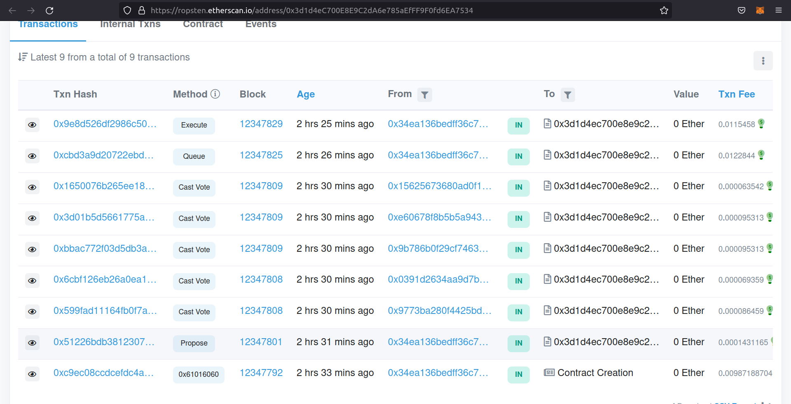
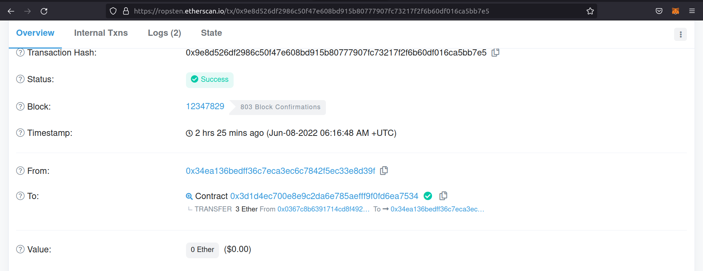

# DAO

## Contract: BlazeToken.sol

- Contract deployed on [ropsten test network](https://ropsten.etherscan.io/address/0x44BA04fC80D1f9D743957e8da52ecB3976F92b77) at:

```script
0x44BA04fC80D1f9D743957e8da52ecB3976F92b77
```

This contract deploys an **ERC20 token with voting rights**.

- Name: "BlazeToken"
- Symbol: "BLZ"
- Decimals: 0

- This token will be used to vote on proposals created in the DAO contract.

- There is no initial supply, but the contract owner can call the **mint()** function to mint tokens to an address.
It takes the address and the amount of tokens to mint as arguments.

- Users would need to call **delegate()** function and pass their own address as argument in order to create a snapshot of their voting power, as only holding the tokens does not give an address the equivalent voting power.

---

## Contract: Treasury.sol

- Contract deployed on [ropsten test network](https://ropsten.etherscan.io/address/0x0367c8B6391714CD8F4924a909e1046534202D59) at:

```script
0x0367c8B6391714CD8F4924a909e1046534202D59
```

- This contract will hold ether and ERC20 tokens and will be used to send ether or ERC20 tokens as donation to charities.

- The members of the DAO can create a proposal where they can specify the receiving address and the amount of ether/ ERC20 token to send as donation.

- If the DAO members pass in favor of the proposal, then the said amount will be sent to the charity address.

- The TimeLock contract is given the ownership of this contract, so that the only way of moving funds out is by creating a proposal and passing it.

---

## Contract: TimeLock.sol

- Contract deployed on [ropsten test network](https://ropsten.etherscan.io/address/0x68aEDA284369e5e985810B0190268932f958Ae2C) at:

```script
0x68aEDA284369e5e985810B0190268932f958Ae2C
```

- This contract is set as the **owner of the Treasury contract**.

- It sets a minimum delay time(number of blocks), that a passed proposal has to wait before getting executed.

- The DAO contract is set as the only PROPOSER, which means that only the DAO contract can suggest this contract to do a transaction through the Treasury contract.

- The Null Address is set as the EXECUTOR, which gives each and every address the right to execute a passed proposal, given that it has waited out the proposed delay time.

---

## Contract: DAO.sol

- Contract deployed on [ropsten test network](https://ropsten.etherscan.io/address/0x3d1d4eC700E8E9C2dA6e785aEfFF9F0fd6EA7534) at:

```script
0x3d1d4eC700E8E9C2dA6e785aEfFF9F0fd6EA7534
```

- This contract creates the DAO ecosystem in which an user can create a proposal and vote on it using the ERC20 BlazeToken.

- Users can create a proposal, cancel it, vote on it, queue it and execute it.

- The proposal stages are as follows:

```script
    Number          Stage

    0               Pending
    1               Active
    2               Canceled
    3               Defeated
    4               Succeeded
    5               Queued
    6               Expired
    7               Executed
```

---

- An user can interact with the **proposal()** function to create a new proposal, which returns the proposal id of the newly created proposal.

- Users can interact with the **castVote()** function to cast their vote on a proposal. It takes 2 arguments, the proposal id and user's choice.

- User has 3 choices when voting:

```script
    Choice      Meaning

    0           Against the proposal
    1           For/ In favor of the proposal
    2           Abstain
```

- If the proposal passes, then any user can interact with the **queue()** function to queue the proposal for execution.

- After that, when the delay period has passed, any user can interact with the **execute()** function which will execute the proposal and the funds will be sent to the charity.

---
---

### Example Proposal

- Created a proposal to send 3 ethers from the Treasury to an address.
- Voting was done and the proposal passed.
- Then it was queued for execution.
- After that, the proposal was executed and funds were successfully transferred from the Treasury contract.

<div align = center margin = auto>
    
</div>

<div align = center margin = auto>
    
</div>

---

### Basic Sample Hardhat Project

This project demonstrates a basic Hardhat use case.

```shell
npx hardhat compile
npx hardhat clean
npx hardhat test
npx hardhat node
node scripts/sample-script.js
npx hardhat help
```
